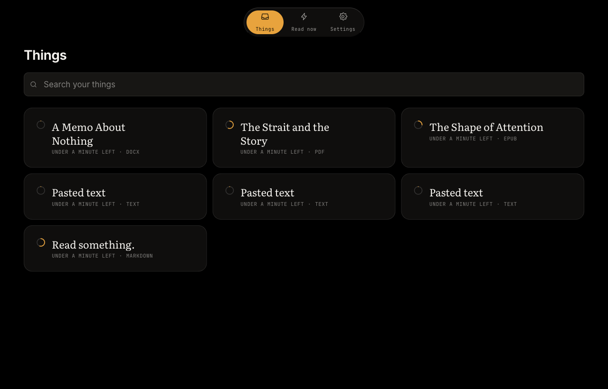
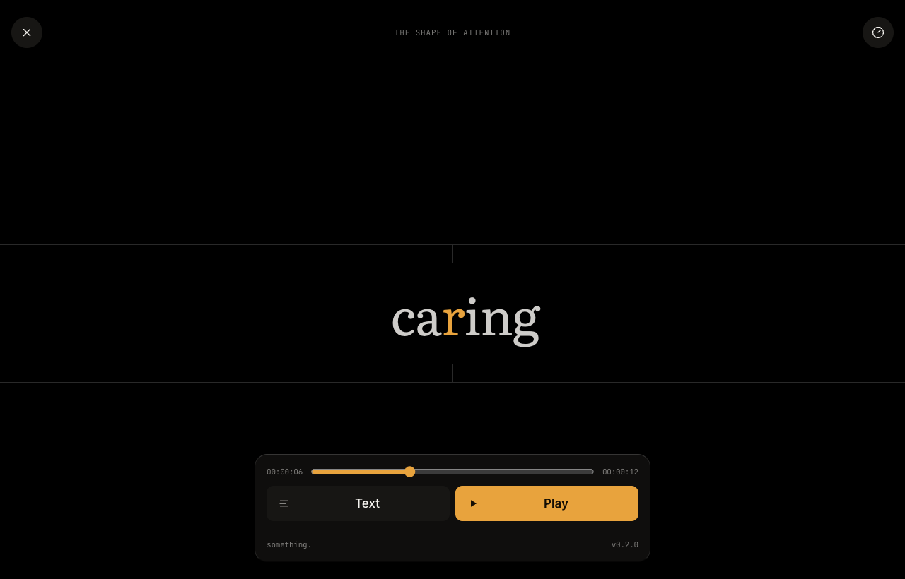
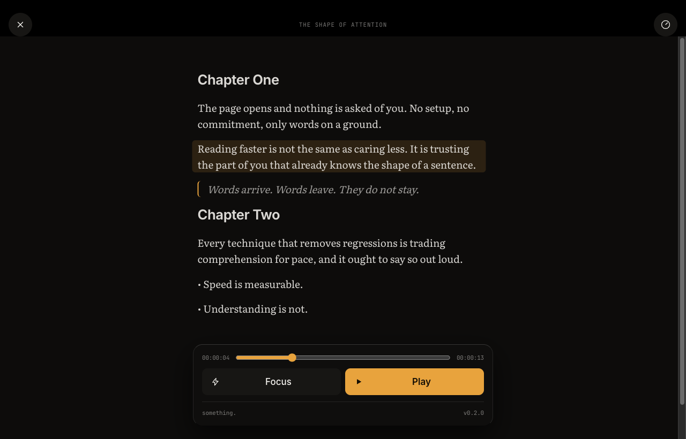

# something.

**Read something.**

Something is a local-first reader for books, PDFs, EPUBs, DOCX, Markdown, web
links, and anything you paste. Drop it in. Read it. Close it. Open it again.
Continue.

No account. No cloud. No paywall on the files you already have.

```
Got something? Drop it here.
```



## What it is

A desktop-and-mobile, open-source reading app. It opens in **Focus** — one word
at a time on its optimal recognition position — and the full text is always one
tap away. Progress survives a restart, and survives re-importing the same file.

It is not Kindle, not Readwise, not a speed-reading gimmick, and not an AI
assistant.

**On speed:** Focus mode will not make you read three times faster. Silent
reading sits around 200–300 WPM, regressions aid comprehension, and RSVP blocks
them. What it does is keep you moving through a backlog you would otherwise not
open. See `docs/research/speed-reading-research.md` for the citations.

|  |  |
|---|---|
|  |  |
| **Focus** — one word on its recognition point | **Text** — the whole thing, in Literata |

## Magic moment

1. Open the app.
2. Import something.
3. Read it — focus mode or the full text.
4. Change the pace if you want.
5. Close the tab.
6. Open it again. You are where you left off.

## Formats

| In | How |
|---|---|
| EPUB | JSZip + the real table of contents |
| PDF | pdf.js text layer, paragraphs rebuilt from line geometry |
| DOCX | mammoth |
| Markdown | markdown-it |
| HTML, TXT | built in |
| Web link | Readability, fetched by your own dev server |
| Pasted text | built in |

Scanned PDFs have no text layer and fail with an honest message rather than a
blank document. Web links go through a local endpoint, so no third-party reader
service ever sees what you read; that one path needs `bun run dev` running.

## Install

```bash
bun install
bun run dev
```

Then open http://localhost:5173.

```bash
bun test        # unit tests
bun run build   # typecheck + production build
```

## Architecture

Core logic lives in `src/core` and does not import React.

| Path | What |
|---|---|
| `src/core/model` | the document model: sections, blocks, stable ids, offsets |
| `src/core/importers` | one importer per format, run in a Web Worker |
| `src/core/engine` | tokenizing, timing, ORP, play/pause/seek — framework-free |
| `src/core/storage` | a `Storage` seam over IndexedDB, with the original bytes |
| `src/ui` | tokens, copy, components |
| `src/app` | screens, providers, hooks |

Decisions are recorded in `docs/adr`. Research is in `docs/research`.

## Brand

**Something** — the brand · **Something Reader** — GitHub, packages, stores, SEO
· `something.` — the wordmark.

A campaign line, not the product name: *Read this shit.*

## License

Apache 2.0.

---

`references/` holds material from other products, for study only. It is
gitignored and must stay that way.
